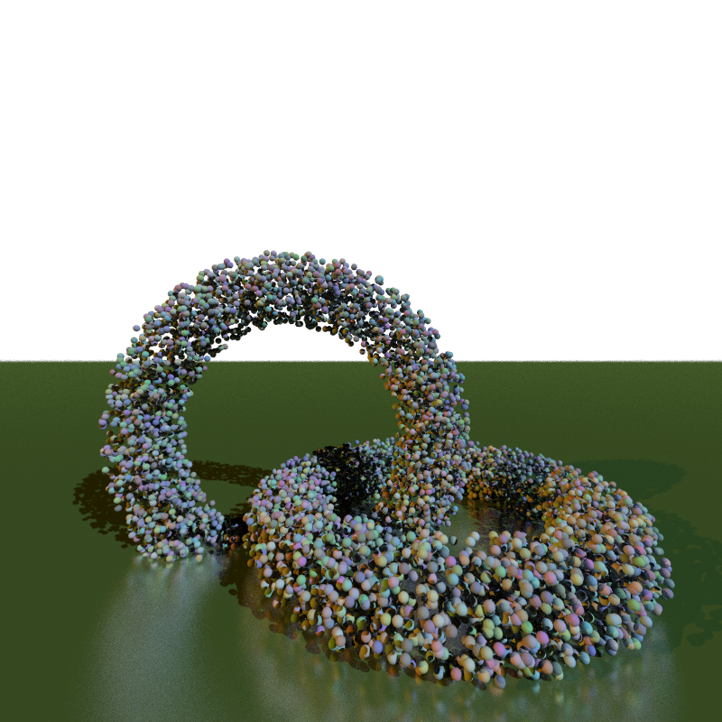
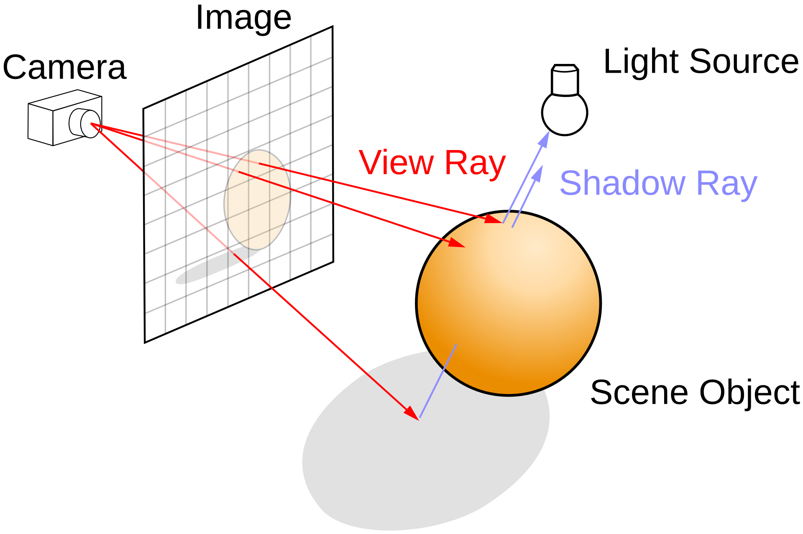
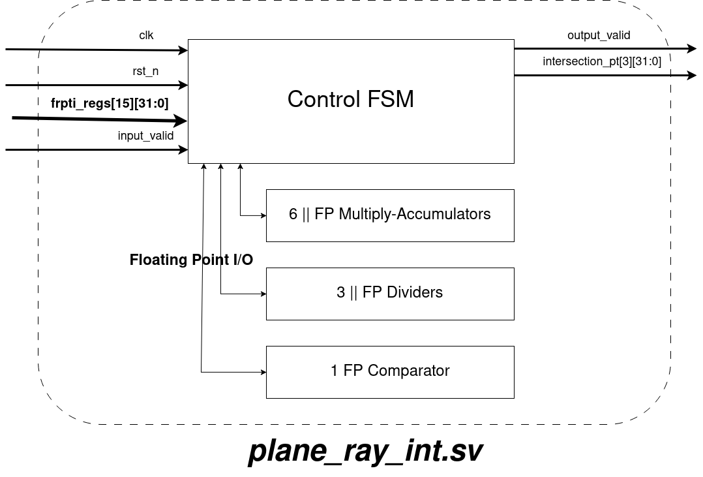

# RTAccelerator: A RISC-V Accelerator for Triangle Intersection in Ray Tracing

This project implements a hardware accelerator for the ray-triangle intersection component of a ray tracing engine, built on a RISC-V core with floating-point support. The accelerator achieves a **70.8% performance improvement** and **69.2% energy reduction** over baseline execution.
- [Final Paper (PDF)](./RV5_RT_Accelerator.pdf)
- [Presentation Slides (PPTX)](./A%20Ray-Tracing%20Accelerator%20for%20Ray-Triangle%20Intersections.pptx.pptx)

## Motivation

  
  

Ray tracing is a physically accurate rendering technique that simulates the path of light rays to produce high-fidelity images. However, it comes at the cost of extreme computational complexity.

**For a 1920×1080 screen rendering a scene with 100,000 triangle meshes**, over **2.07 × 10¹¹** ray-triangle intersection tests are needed — and that’s *before* accounting for reflections, refractions, shadow rays, global illumination, or bounding volume hierarchy (BVH) traversal overheads.

## Abstract

Ray tracing simulates light by casting rays through pixels and determining their interactions with 3D triangle meshes. While realistic, it incurs a significant computational cost. This project presents a hardware accelerator for ray-triangle intersection, implemented as a finite state machine integrated with a RISC-V core. Using custom floating-point units and parallel computation, the accelerator significantly reduces clock cycles and energy usage.

  

## Tools Used

- Synopsys Design Compiler
- Verilator
- VCS / Verdi
- RISC-V RI5CY core with fpnew integration
